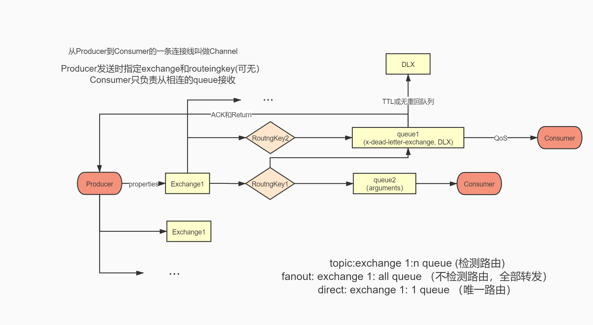

rabbitMQ 高级
发消息： 生产者指定交换机名和路由
接消息： 消费者通过与交换机的绑定信息，根据路由规则和交换机类型，发送到消息队列上
        指定生产者时必须进建立监听者，监听者负责对接收到的消息处理
Consumer Producer (基本)

/message/Consumer,Producer （消息传递携带信息） 

/fanout/...

/direct/...

/topic/...

/consumer/...  （自定义consumer）

- 100%成功投递
- 幂等性
- 消息确认机制 confirm
- 消息返回机制 return
- ACK与重回队列 ack
- 消息的限流 limit
- 超时时间 
- 死信队列 DLX

api详见https://rabbitmq.github.io/rabbitmq-java-client/api/current/
常用api
channel.addReturnListener()

channel.addConfirmListener()

channel.basicPublish(exchangeName, routingKey, basicProperties, msg);

channel.basicConsume(queueName, autoAck, consumer);

等

